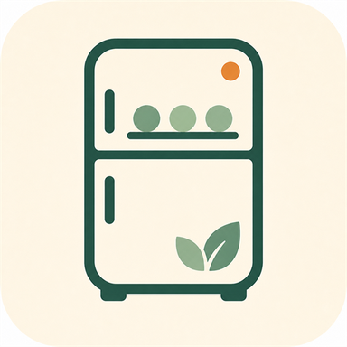
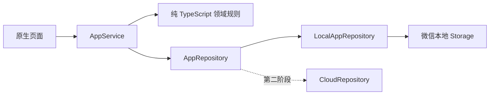

<div align="center">
  

  # 冰箱有数

  **记住家里有什么，先吃快到期的，马上知道能做什么。**

  冰箱有数，吃饭不愁。

  微信原生小程序 · TypeScript · 本地优先 · 无需登录
</div>

---

买菜回家随手记一下，冰箱里还剩什么、哪些应该先吃、今天能做什么，就不用再靠记忆。

**冰箱有数**是一款温暖、轻量的家庭食材管理小程序。它按每次购入记录独立批次，动态提示新鲜度，根据真实库存匹配食谱；做完一道菜后，会从建议到期更早的批次开始扣减。缺少的食材还能直接加入购物清单，买到后再一键记回冰箱。

首版不要求注册或登录，不连接后端。你的库存、做菜记录和购物清单只保存在当前设备的微信本地空间。

## 为什么做冰箱有数

日常做饭最麻烦的，往往不是“不会做”，而是这些细碎的问题：

- 买过什么记不清，重复买或忘记吃。
- 同一种食材分几次购入，不知道哪一批应该先用。
- 冰箱里明明有菜，临到饭点却想不到能做什么。
- 看中一道食谱，缺什么要重新整理购物清单。
- 食材用了多少、还剩多少，全凭大概估计。

冰箱有数把这些动作连成一条简单的日常路径：

```text
买菜记入冰箱 → 看今天先吃什么 → 按库存选食谱
     ↑                                ↓
购物清单补货 ← 发现缺料 ← 做菜并自动扣减批次
```

## 你可以做什么

### 冰箱里的每样食材都有数

- 每次购入形成独立批次，保留数量、购入日期、保存方式和备注。
- 同一种食材在列表中自动汇总，详情里仍能看到每一个批次。
- 支持常温、冷藏和冷冻，食材可使用默认保存期，也可按实际情况调整。

### 先吃什么，一眼就知道

- 新鲜度会随日期动态计算，而不是保存一个会过时的固定标签。
- 使用“新鲜、正常、尽快使用、超过建议期”四种清楚但不过度恐吓的状态。
- 首页优先展示提醒范围内的食材，帮助减少遗忘和浪费。

> 新鲜度只表示个人库存管理中的建议保存期进度，不构成食品安全判断。请始终结合气味、外观和实际保存情况判断。

### 家里有什么，就做什么

- 食谱根据当前库存计算匹配度，只把必选配料计入是否可做。
- 食谱拥有“未解锁、可解锁、已掌握”三种独立进度。
- Starter、历史入库和前置食谱三类解锁条件，让食谱库有自然的成长感。

### 做完一道菜，库存也同步更新

- 提交前先预览将要使用的食材和批次，不会提前修改库存。
- 确认后按 FEFO（预计到期日优先）跨批次扣减。
- 用完的批次自动标记完成，并生成一条 `CookingRecord`。

### 缺什么，顺手加入购物清单

- 食谱缺少的必选食材可以一键加入购物清单。
- 支持手动添加、勾选、删除和“转购入”。
- 买到后会自动预填食材与数量，入库成功后勾选原购物项。

## 产品体验

冰箱有数采用温暖、干净的厨房收纳风：

- **冰箱深绿 `#24564A`**：可靠、安静，是品牌与主要操作色。
- **鼠尾草绿 `#7FAE8B`**：表达新鲜、完成和匹配进度。
- **奶油底色 `#F7F2E8`**：让长时间查看库存也保持柔和。
- **暖橙 `#E7A05B`**：用于临期提醒和需要留意的信息。

应用图标由正面冰箱、三个库存状态点和一个暖橙提醒点组成。完整品牌规范见 [BRAND_GUIDE.md](./BRAND_GUIDE.md)。

## 页面一览

| 页面 | 主要用途 |
|---|---|
| 首页 | 库存概览、优先食材、今日可做食谱 |
| 冰箱 | 按食材聚合库存，筛选新鲜度与分类 |
| 食材详情 | 查看批次数量、保存进度与备注 |
| 购入食材 | 记录数量、日期、保存方式和建议保存期 |
| 食谱库 | 查看锁定状态、库存匹配度与缺料情况 |
| 食谱详情 | 解锁食谱、查看配料、步骤与替换建议 |
| 做菜确认 | 预览并执行 FEFO 跨批次扣减 |
| 购物清单 | 管理待买食材并转成真实购入批次 |
| 我的 | 统计、偏好、JSON 导出与本地数据管理 |

## 隐私与数据

当前版本坚持本地优先：

- 不要求微信登录，不获取头像、昵称或手机号。
- 不请求位置、相册、摄像头或通讯录。
- 不发起网络请求，不连接开发者服务器或云数据库。
- 业务数据只写入当前微信客户端为本小程序分配的本地 Storage。
- 支持在“我的”中导出完整 JSON，或清空本机数据。

换手机、卸载微信、清理小程序数据或清除开发者工具缓存后，本地数据可能丢失。详细存储位置、字段和 key 见 [DATA_STORAGE.md](./DATA_STORAGE.md)。

## 技术原则

- 微信原生小程序，不使用 React、Vue、Taro 或 uni-app。
- 业务代码使用 TypeScript，核心领域规则保持纯函数、可单元测试。
- 页面只调用 `AppService`，禁止直接读写微信 Storage。
- `LocalAppRepository` 是唯一的本地持久化实现。
- 预留 `CloudRepository` 契约，未来接入云同步时无需让页面直接依赖后端。
- 正式配置关闭演示库存，新用户第一次打开看到真实的空冰箱。



## 核心业务规则

- `fresh / good / useSoon / overdue` 四状态动态新鲜度。
- 同食材多批次聚合，批次仍保持独立。
- 必选配料决定 availability，可选配料不足不阻塞做菜。
- `locked / unlockable / mastered` 食谱进度与库存状态解耦。
- FEFO 按“预计到期日 → 购入时间 → 创建时间”稳定排序并支持跨批次扣减。
- 完成烹饪原子地产生库存变化、批次状态、`CookingRecord` 和食谱次数更新。

关键实现：

- [领域模型](./miniprogram/domain/models.ts)
- [领域规则](./miniprogram/domain/rules.ts)
- [应用服务](./miniprogram/services/app.service.ts)
- [Repository 契约](./miniprogram/repositories/types.ts)
- [本地 Repository](./miniprogram/repositories/local/local-app.repository.ts)

## 本地运行

### 微信开发者工具

1. 安装微信开发者工具。
2. 选择“导入项目”。
3. 项目目录选择仓库根目录，不要只选择 `miniprogram` 子目录。
4. 工具会依据 `project.config.json` 直接编译 TypeScript，无需执行“构建 npm”。
5. 编译完成后，从“购入食材”开始体验完整闭环。

当前项目配置对应 AppID `wxc62caa8eb9379ed4`。若将代码用于其他小程序，请替换 AppID：

```bash
node scripts/set-appid.mjs wx1234567890abcdef
```

### 自动检查

需要 Node.js 22+ 与 pnpm：

```bash
pnpm install --frozen-lockfile
pnpm run typecheck
pnpm test
pnpm run check
pnpm run release:check
```

当前验证结果：

- 15 个测试场景全部通过。
- TypeScript 严格检查 0 错误。
- 9 个页面与 110 个小程序文件通过静态检查。
- JSON、WXML、本地资源和 Repository 边界检查通过。
- 正式主包约 477.3 KiB。
- 未发现登录、网络请求或云端调用。
- 微信开发者工具实际渲染通过，问题面板为 0。

完整记录见 [TEST_RESULTS.md](./TEST_RESULTS.md)。

## 项目结构

```text
bingxiang-youshu-miniprogram/
├─ miniprogram/
│  ├─ pages/                 9 个原生页面
│  ├─ components/            新鲜度与空状态组件
│  ├─ domain/                纯 TypeScript 模型和业务规则
│  ├─ services/              应用用例与页面视图模型
│  ├─ repositories/          本地实现与云端契约
│  ├─ data/                  食材、食谱和应用配置
│  └─ assets/png/            本地视觉资源
├─ tests/                    领域与应用闭环测试
├─ scripts/                  静态检查、发布门禁和 AppID 工具
├─ BRAND_GUIDE.md            品牌规范
├─ DATA_STORAGE.md           数据存储说明
├─ REVIEW_NOTES.md           微信审核说明
├─ RELEASE_CHECKLIST.md      上线清单
└─ PRIVACY_NOTICE_TEMPLATE.md
```

## 当前版本

当前代码版本为 **1.1.0**，完成了“冰箱有数”品牌、图标、配色、首页、“我的”和分享文案升级。

- 原“食仓”1.0.0 上传记录保留，便于回溯。
- “冰箱有数”1.1.0 已于 2026-08-12 上传微信开发版本，并自动覆盖原体验版，可直接真机测试。
- 当前尚未提交微信审核或正式发布。
- 首版明确不包含账号登录、云同步、家庭共享、订阅消息、扫码识别和营养建议。

提审前请逐项核对 [RELEASE_CHECKLIST.md](./RELEASE_CHECKLIST.md)。

## 产品路线

- **现在**：把食材批次、新鲜度、食谱和购物清单的本地闭环做稳定。
- **下一步**：真机体验优化、数据导入、更多食谱与更轻的录入方式。
- **未来**：在隐私与数据迁移方案完善后，再考虑登录、云同步和家庭共享。

---

<div align="center">
  少忘一点，少浪费一点；打开冰箱时，心里多一点数。
</div>
