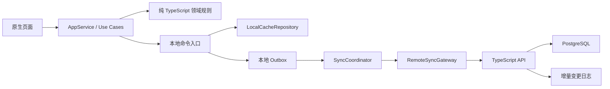
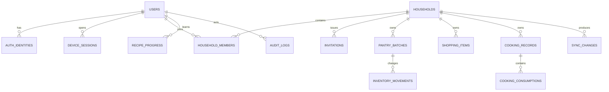
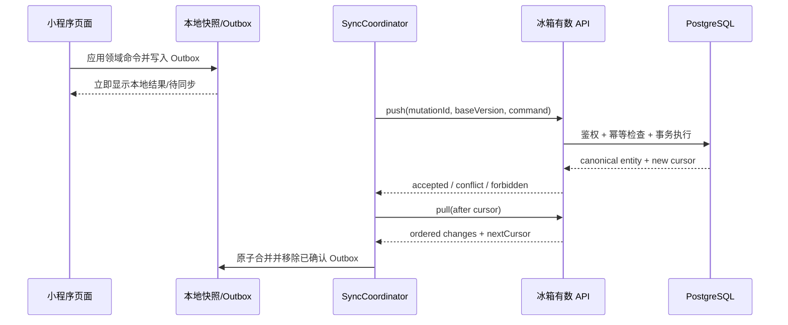

# 冰箱有数 2.0：多用户管理与云端数据同步设计

> 状态：待开发方案  
> 目标版本：2.0  
> 文档版本：1.0  
> 更新日期：2026-08-13  
> 适用范围：微信原生小程序、TypeScript 服务端、运营管理后台

## 1. 文档目的

本文定义“冰箱有数”从 1.x 纯本地单设备产品升级为 2.0 多用户、家庭共享和跨设备同步产品的预期实现。它用于产品评审、技术选型、任务拆分、测试和上线验收，不代表当前版本已经具备服务器或云同步能力。

2.0 必须在不破坏 1.x 核心领域规则的前提下解决四个问题：

1. 一个微信用户可以拥有稳定的冰箱有数账号，并在多台设备上看到自己的数据。
2. 多名用户可以加入同一个“家庭冰箱”，按权限共同维护库存和购物清单。
3. 离线操作可以先保存在本机，联网后可靠同步，重复请求不会造成重复购入或重复扣减。
4. 1.x 的 `pantry:v1:*` 本地数据只有在用户明确同意后才迁移，迁移失败可以安全回退。

## 2. 产品原则

### 2.1 必须保留的体验

- **游客可用**：未登录用户继续使用完整的本地单人模式，不以登录阻断首次体验。
- **主动开启云同步**：只有用户点击“开启云同步/家庭共享”并阅读说明后，才发起微信登录和数据迁移。
- **本地优先**：进入页面和日常操作先读写本地缓存；网络恢复后由同步协调器在后台收敛到服务端状态。
- **数据最小化**：不强制获取微信昵称、头像或手机号。内部账号只依赖服务端确认的微信身份标识。
- **领域规则不下沉到页面**：freshness、availability、食谱状态和 FEFO 仍由纯 TypeScript 领域层维护并测试。
- **库存不能负数**：跨设备并发做菜时，以服务端事务的最终 FEFO 分配为准。

### 2.2 2.0 范围

- 微信身份登录、会话和设备管理。
- 用户资料的最小化管理、退出登录、数据导出和账号注销。
- 家庭冰箱创建、切换、邀请、加入、成员权限和退出。
- 库存批次、购物清单、做菜记录和设置的跨设备增量同步。
- 1.x 本地数据迁移、重复迁移保护和回滚。
- 运营管理后台、审计、备份、监控和故障恢复。

### 2.3 明确不纳入 2.0 首发

- 手机号登录、短信登录、第三方社交账号绑定。
- 支付、会员订阅、广告系统。
- 实时聊天、社区内容或公开用户主页。
- 营养/医疗结论、食品安全自动判定。
- 依赖持续定位、相册、通讯录等与核心同步无关的权限。
- 复杂的多人实时协同编辑；2.0 使用增量同步和前台短轮询，不引入 WebSocket 常驻连接。

## 3. 当前 1.1.0 基线与改造缺口

当前生产代码使用 `LocalAppRepository`，通过 `wx.getStorageSync` / `wx.setStorageSync` 保存 `AppSnapshot`。页面只调用 `AppService`，没有登录、网络请求或服务器。

现有 `CloudAppRepository` 只是占位契约，不能直接填入 HTTP 请求后投入使用，原因包括：

- `AppRepository` 是同步快照接口，而网络调用天然异步且可能离线或超时。
- 现有数据没有 `householdId`、`userId`、`version`、删除墓碑和幂等请求 ID。
- 多个 `save*` 调用在本机尚可回滚，但跨网络和数据库时必须使用服务端事务。
- 直接用“最后写入覆盖”会丢失另一台设备的购入、做菜或购物清单操作。

2.0 不应把页面直接改成调用后端，而应把持久化拆成：



## 4. 用户、家庭空间与数据归属

### 4.1 核心概念

| 概念 | 说明 |
|---|---|
| `User` | 冰箱有数内部用户，使用服务端生成的不可猜测 ID，不直接以 `openid` 作为业务主键。 |
| `AuthIdentity` | 用户与微信小程序身份的绑定；保存微信身份提供方和服务端取得的 provider subject。 |
| `DeviceSession` | 一次设备登录会话，可单独撤销，记录最后活跃时间和安全元数据。 |
| `Household` | 一个独立的家庭冰箱/共享空间，是库存数据的租户边界。 |
| `HouseholdMember` | 用户与家庭空间的成员关系、角色和状态。 |
| `Invitation` | 加入家庭的短期一次性或限次凭证，可撤销、可过期。 |

### 4.2 多空间规则

- 一个用户默认可以创建 1 个个人家庭空间，也可以加入其他家庭空间。
- 2.0 首发建议限制：每个用户最多加入 5 个有效空间，每个空间最多 10 名有效成员；限制应在服务端配置，不写死在小程序。
- 小程序保存 `activeHouseholdId`，页面上所有库存、购物清单和可做食谱都以当前空间计算。
- 切换家庭时先切换本地缓存命名空间，再拉取该家庭增量，禁止把 A 家庭的本地快照写入 B 家庭。
- 家庭名称、时区和家庭级提醒策略属于 `Household`；个人默认保存方式、通知偏好属于用户在该家庭内的偏好。

### 4.3 数据归属决策

| 数据 | 归属 | 原因 |
|---|---|---|
| 食材/食谱官方目录 | 系统级 | 由产品发布并按目录版本更新。 |
| 食材批次、库存流水 | 家庭级 | 所有家庭成员看到同一库存。 |
| 购物清单 | 家庭级 | 支持多人共同采购和勾选。 |
| 做菜记录、实际扣减 | 家庭级 | 会影响共享库存，并记录操作者。 |
| 食谱 availability | 家庭级派生数据 | 由当前家庭库存实时计算，不持久化为事实。 |
| 食谱解锁/掌握进度 | 用户 + 家庭 | “谁会做”是个人能力，但与当前家庭使用场景关联。 |
| 新鲜度阈值、默认保存方式 | 用户 + 家庭 | 不强迫所有成员使用相同显示偏好。 |
| 账号、会话、隐私选择 | 用户级 | 不应随家庭切换。 |
| `purchasedIngredientIds` | 家庭级派生数据 | 从购入/库存流水计算，不再作为唯一事实源。 |

## 5. 成员角色与权限

建议定义四种角色，2.0 首发界面可先开放 `owner`、`member`，数据库和授权层一次性支持完整模型。

| 操作 | owner | admin | member | viewer |
|---|:---:|:---:|:---:|:---:|
| 查看库存、食谱、记录 | ✓ | ✓ | ✓ | ✓ |
| 购入、调整、丢弃食材 | ✓ | ✓ | ✓ | — |
| 做菜并扣减库存 | ✓ | ✓ | ✓ | — |
| 新增/勾选购物项 | ✓ | ✓ | ✓ | — |
| 修改家庭设置 | ✓ | ✓ | — | — |
| 邀请成员 | ✓ | ✓ | — | — |
| 移除普通成员 | ✓ | ✓ | — | — |
| 调整成员角色 | ✓ | 仅 member/viewer | — | — |
| 转移所有权 | ✓ | — | — | — |
| 删除家庭空间 | ✓ | — | — | — |

强制约束：

- 每个有效家庭必须且只能有一个 `owner`。
- owner 退出前必须先转移所有权，或明确删除整个家庭空间。
- admin 不能移除 owner，也不能授予 owner。
- 所有授权由服务端根据会话用户和数据库成员关系判断；客户端传入的 `userId`、`role`、`householdId` 不能作为授权依据。
- 被移除或冻结的成员，其下一次同步必须立即得到明确错误并清除该家庭的本地凭证与缓存展示权限。

## 6. 登录与会话方案

### 6.1 微信登录流程

1. 用户点击“开启云同步”或“加入家庭”。
2. 小程序调用 `wx.login` 取得一次性临时 code。
3. 小程序把 code 和本机生成的 `deviceId` 发送到冰箱有数 API。
4. 服务端使用保存在密钥管理系统中的 AppSecret 调用微信服务端换取身份信息；AppSecret 永不进入小程序、Git、日志或管理后台页面。
5. 服务端查找或创建 `AuthIdentity` 和 `User`，创建 `DeviceSession`。
6. 服务端返回短时效不透明 access token；token 仅用于冰箱有数 API，并通过 `Authorization` 请求头发送。
7. token 过期或服务端返回未认证时，前台再次执行 `wx.login` 换取新会话。首发不在本地长期保存高权限 refresh token。

实施时必须根据当期微信官方文档复核登录换码接口、临时 code 时效、合法请求域名、TLS、隐私保护指引和主体配置，不把这些易变化参数写死在领域代码中。

### 6.2 账号规则

- 微信身份标识只作为 `AuthIdentity.providerSubject`，业务外键统一使用内部 `userId`。
- 账号首次创建不要求昵称和头像；默认显示名可以是“家庭成员 1”，由用户自行修改。
- 若未来接入多个小程序或公众号，可在满足微信平台条件后增加 UnionID 绑定，但不能假设所有用户都一定有 UnionID。
- 同一微信身份重复登录必须返回同一内部用户；数据库对 `(provider, appId, providerSubject)` 建唯一约束。
- 退出登录需撤销当前 `DeviceSession`、清除 access token，并在处理未同步操作后清除共享家庭缓存，避免共用设备泄露数据。

## 7. 服务端总体架构

### 7.1 推荐技术栈

- API：Node.js 22+、TypeScript、Fastify 或 NestJS，REST/JSON。
- 数据库：PostgreSQL，使用事务、行锁、唯一约束和增量序列保证库存一致性。
- 缓存/限流：Redis；早期流量较低时可选，但接口层必须预留限流抽象。
- 异步任务：数据库任务表起步；规模增长后再引入托管消息队列。
- 部署：容器化，至少测试/预发布/生产三套隔离环境。
- 密钥：云密钥管理或部署平台 Secret，不通过环境文件提交到 Git。
- 备份：数据库时间点恢复能力 + 加密全量备份 + 定期恢复演练。

选择 PostgreSQL 而不是把每个用户的整个 JSON 快照作为一条记录，主要是为了可靠处理家庭成员关系、租户隔离、FEFO 并发扣减、审计、幂等和增量同步。

### 7.2 网络边界

- 小程序只访问一个版本化 API 域名，例如 `https://api.example.com/v2`；实际域名在主体、备案和平台配置完成后确定。
- 管理后台使用独立域名和独立身份系统，不复用普通用户 access token。
- 数据库、Redis 和内部管理接口不暴露公网入口。
- 所有请求带 `requestId`；写操作额外带 `mutationId`，敏感请求日志必须脱敏。

## 8. 数据库设计

所有业务表使用不可猜测 ID（推荐 UUIDv7 或 ULID）、UTC 服务端时间、整数版本号和软删除字段。涉及家庭数据的每一张表必须包含 `household_id`，并建立组合索引。



### 8.1 身份与家庭表

| 表 | 关键字段 |
|---|---|
| `users` | `id`, `display_name`, `status`, `created_at`, `deleted_at` |
| `auth_identities` | `user_id`, `provider`, `app_id`, `provider_subject`, `created_at`；provider 组合唯一 |
| `device_sessions` | `id`, `user_id`, `device_id_hash`, `token_hash`, `expires_at`, `revoked_at`, `last_seen_at` |
| `households` | `id`, `name`, `timezone`, `owner_user_id`, `status`, `version` |
| `household_members` | `household_id`, `user_id`, `role`, `status`, `joined_at`, `version`；成员组合唯一 |
| `invitations` | `id`, `household_id`, `token_hash`, `role`, `expires_at`, `max_uses`, `used_count`, `revoked_at` |

邀请链接或分享卡片只携带随机邀请 token，不携带 `openid`、手机号或家庭数据库主键。token 服务端只存哈希，建议默认 72 小时过期、一次使用，可由邀请人提前撤销。

### 8.2 库存与业务表

| 表 | 关键字段与说明 |
|---|---|
| `pantry_batches` | `household_id`, `ingredient_id`, 原始购入量、单位、购入日期、保存方式、保鲜覆盖、备注、状态、`version` |
| `inventory_movements` | 不可变流水：`purchase`, `cook_consume`, `adjust`, `discard`；包含数量、批次、操作者、来源命令和时间 |
| `shopping_items` | 家庭、食材、建议数量、单位、来源食谱、勾选状态、操作者、`version`, `deleted_at` |
| `cooking_records` | 家庭、食谱、份数、操作者、烹饪时间、幂等命令 ID；创建后不直接修改 |
| `cooking_consumptions` | 做菜记录与实际批次扣减明细；由服务端 FEFO 事务生成 |
| `recipe_progress` | `user_id`, `household_id`, `recipe_id`, 状态、做菜次数、最后烹饪时间、`version` |
| `member_preferences` | 用户在家庭内的新鲜度提醒天数、默认保存方式、通知设置、`version` |
| `sync_changes` | 家庭递增 `cursor`, entity 类型/ID、操作、版本、最小变更载荷、服务端时间 |
| `processed_mutations` | `user_id + mutation_id` 唯一，保存处理结果摘要，用于幂等重放 |
| `audit_logs` | 操作者、动作、目标、理由、前后版本摘要、请求 ID；只追加不修改 |

库存剩余量应由“购入基数 + 不可变流水”得到，`pantry_batches.remaining_quantity` 可以作为事务内维护的查询缓存，但不能成为没有审计来源的唯一事实。

### 8.3 目录数据

- 官方 `ingredients` 和 `recipes` 由产品版本管理，使用稳定字符串 ID 与 `catalogVersion`。
- availability、freshness 和 FEFO 排序结果继续即时计算，不保存为可被同步覆盖的事实。
- 自定义食材/食谱若后续加入，必须有 `scope=household`、创建者和审核/删除策略；不混入官方目录主键空间。

## 9. 客户端本地存储与 Repository 改造

### 9.1 新职责

```text
LocalCacheRepository   负责当前家庭的可用快照
OutboxRepository       负责未确认的本地命令
RemoteSyncGateway      负责认证后的 push / pull / bootstrap
SyncCoordinator        负责触发、重试、游标、冲突和状态机
MigrationService       负责 pantry:v1:* 到 v2 家庭空间的迁移
```

`AppService` 的页面读模型仍从本地快照生成。会影响共享数据的写操作改为领域命令，例如 `PurchaseBatch`、`CompleteCooking`、`CheckShoppingItem`，本地应用成功后写入 Outbox。

### 9.2 建议本地 key

| Key | 内容 |
|---|---|
| `pantry:v2:device` | 随机设备 ID 与客户端数据版本，不含微信身份密钥。 |
| `pantry:v2:user` | 当前内部用户的最小展示信息。 |
| `pantry:v2:households` | 可访问家庭摘要和 `activeHouseholdId`。 |
| `pantry:v2:h:{id}:envelope` | 当前家庭快照、Outbox、同步 cursor 和冲突列表的同一事务信封。 |
| `pantry:v2:migration` | 1.x 迁移阶段、导入批次 ID、校验摘要和回滚状态。 |

首发建议把“快照 + Outbox + cursor”写在同一 envelope 中，通过一次 `wx.setStorageSync` 完成本地原子替换。数据量增长后再按实体分片并加入本地 write-ahead journal，不能先拆成多个无事务 key 再假设全部写入成功。

### 9.3 同步触发

- 登录或 `App.onShow`。
- 用户切换家庭。
- 共享数据写入后立即尝试，但不阻塞本地成功反馈。
- 网络从离线恢复。
- 前台每 30–60 秒进行轻量 pull；间隔由远程配置调整。
- 用户在“同步状态”页手动重试。

小程序进入后台后不承诺持续同步；页面必须清楚显示“已同步”“待同步 N 项”“同步失败，点击重试”和“需要处理冲突”。

## 10. 增量同步协议

### 10.1 Push 命令

每个本地命令至少包含：

```json
{
  "mutationId": "01...",
  "deviceId": "device_...",
  "householdId": "hh_...",
  "command": "CompleteCooking",
  "entityId": "cook_...",
  "baseVersion": 7,
  "payload": {},
  "clientOccurredAt": "2026-08-12T12:00:00.000Z"
}
```

- `mutationId` 在客户端创建后永不改变，重试必须复用同一个 ID。
- 服务端先验证会话和成员权限，再检查 `processed_mutations`。
- 已处理 mutation 返回第一次的同一结果，不重复产生库存流水。
- 服务端时间和 entity `version` 是同步顺序依据；客户端时间只作为展示/审计参考。
- 一个命令涉及批次、做菜记录、流水、食谱进度和 `sync_changes` 时，必须在同一个数据库事务提交或全部回滚。

### 10.2 Pull 变更

- 每个家庭维护单调递增 cursor。
- `GET /sync/pull?householdId=...&cursor=...` 返回 cursor 之后的有序变更、最新目录版本和 `nextCursor`。
- 客户端只有在整批变更成功应用到本地 envelope 后才保存 `nextCursor`。
- cursor 过旧、变更被压缩或本地校验失败时，服务端返回 `FULL_RESYNC_REQUIRED`，客户端重新下载家庭 bootstrap 快照。
- 删除使用墓碑事件，不能仅从服务端列表消失，否则离线客户端会把旧数据重新上传。

### 10.3 标准同步循环



## 11. 冲突解决规则

不能对全部数据统一使用 last-write-wins。每种领域对象使用明确策略：

| 场景 | 处理策略 |
|---|---|
| 重复购入请求 | `mutationId` 幂等，永远只创建一个批次和一条购入流水。 |
| 两台设备同时做菜 | 服务端在事务中锁定候选批次并重新执行 FEFO；第二个命令库存不足时整体拒绝，不产生半条记录。 |
| 离线做菜后库存已变化 | 服务端允许按当前库存重新分配 FEFO；若总量仍足够则接受并返回 canonical 分配，否则返回 `INVENTORY_CONFLICT` 让用户调整或取消。 |
| 批次备注/保存方式并发编辑 | 使用 `baseVersion` 乐观锁；不同字段可自动合并，同字段冲突进入冲突页。 |
| 购物项勾选 | 服务端版本优先；重复设为相同值视为幂等。删除墓碑优先于旧版本更新。 |
| 多人同时新增同一食材购物项 | 保留两条来源记录；服务端可返回“建议合并”，不静默丢弃任一人的输入。 |
| 食谱掌握状态 | 状态只能向前推进；`mastered` 不被旧设备降级，做菜次数由不可变做菜记录聚合。 |
| 个人设置 | 每字段版本；同字段冲突使用服务端最后接收版本并在同步日志记录。 |
| 成员被移除后的离线写入 | 拒绝全部后续写入，不由客户端缓存的旧角色继续授权。 |

冲突界面至少展示：操作类型、本机操作时间、服务端当前值、推荐处理方式。库存冲突不能只显示“同步失败”，必须让用户选择“按当前库存重新确认”“仅保留做菜记录不扣库存（需 owner/admin 权限）”或“取消本次操作”。

## 12. 关键服务端事务

### 12.1 完成做菜

1. 验证 mutation 幂等、家庭成员写权限、食谱与份数。
2. 查询并锁定当前家庭所需食材的 active 批次。
3. 使用与客户端同一套纯 TypeScript FEFO 规则重新计算分配。
4. 任一必需食材不足则回滚并返回结构化 missing/conflict，不发生部分扣减。
5. 写入 `cooking_records`、`cooking_consumptions` 和 `inventory_movements`。
6. 更新批次查询缓存与版本，追加 `sync_changes`，记录操作者。
7. 提交后返回服务端最终分配和 cursor。

### 12.2 购物清单转购入

必须在一个事务中创建购入批次/流水并勾选原购物项。重复点击或网络重试通过同一 mutation 只执行一次。

### 12.3 删除家庭

- 仅 owner 可发起，需二次确认。
- 先进入可恢复的待删除状态并撤销所有家庭会话访问；宽限期作为上线前产品/合规配置项确认。
- 到期任务清除或匿名化数据，保留必要审计摘要，不在普通管理后台提供恢复明文业务数据的捷径。

## 13. 1.x 本地数据迁移

### 13.1 用户体验

1. 检测到 `pantry:v1:*` 时继续正常本地使用，不自动上传。
2. 用户主动开启云同步后，先说明将上传的内容：库存批次、购物清单、做菜记录、食谱进度和设置。
3. 用户选择“创建新家庭并迁移”或“加入家庭但暂不迁移”。加入已有家庭时不得默认合并本地库存。
4. 迁移前生成本地 JSON 备份与只读校验摘要。
5. 服务端使用 `importBatchId` 幂等导入，返回数量、批次数、记录数和校验摘要。
6. 客户端拉取 canonical 快照，核对成功后才切换至 v2 active household。
7. `pantry:v1:*` 至少保留为只读回退数据，直到用户确认和一个稳定版本周期结束；清理前再次提示。

### 13.2 数据转换

- 现有批次生成 `pantry_batches` 和对应 `purchase`/初始余额流水。
- `CookingRecord.consumptions` 保持原批次引用；无法匹配的历史项进入迁移报告，不静默删除。
- `RecipeProgress` 迁移到创建家庭的用户 + 家庭作用域。
- `AppSettings` 迁移为该用户在家庭内的偏好。
- `purchasedIngredientIds` 从迁移后的购入历史重新计算。
- 所有旧 ID 保留或记录 `legacy_id` 映射，避免食谱引用和历史记录断裂。

### 13.3 失败与回滚

- 导入事务失败时服务端不留下半个家庭快照。
- 客户端保持 1.x 为当前数据源，并允许重试同一 `importBatchId`。
- 切换后首次同步失败不删除 v1 数据。
- 提供只读迁移报告：成功数、跳过数、冲突数、原因和恢复建议。

## 14. 运营管理后台

管理后台是受控运维工具，不是让运营人员随意查看用户冰箱内容的数据库浏览器。

### 14.1 后台角色

| 角色 | 权限 |
|---|---|
| `support_readonly` | 查看账号状态、会话数量、家庭数量、同步错误摘要；默认看不到明文库存备注。 |
| `support_operator` | 撤销会话、重新发送系统任务、协助注销/导出流程；不能直接改库存。 |
| `catalog_editor` | 管理官方食材和食谱草稿、发布目录版本。 |
| `security_auditor` | 查询审计事件、安全告警和高风险操作，不修改业务数据。 |
| `super_admin` | 紧急系统管理；必须强认证、最小人数、操作原因和完整审计。 |

### 14.2 首发功能

- 按内部 user ID、household ID、request ID 查询，不支持按任意敏感信息模糊扫库。
- 查看账号状态、创建时间、最后活跃、会话和家庭成员关系。
- 撤销单个/全部设备会话。
- 查看同步 cursor、Outbox 错误上报、冲突类型和重试状态。
- 执行账号导出、注销和家庭删除的工作流跟踪。
- 管理邀请滥用、成员关系争议和限流封禁。
- 发布官方食材/食谱目录版本并支持回滚。
- 查看 API、数据库、任务队列和备份健康度。

### 14.3 高风险限制

- 默认禁止后台直接编辑库存、做菜记录或购物清单。
- 必须查看明文业务数据的支持场景采用 break-glass：工单号、原因、限定时间、二次认证和审计告警。
- 管理员不能读取 AppSecret、token 原文或数据库备份密钥。
- 后台所有写操作必须使用与 API 相同的领域命令和审计机制，禁止直接执行手工 SQL 改业务事实。

## 15. 安全与隐私要求

- AppSecret、数据库密码、签名密钥放入密钥管理系统并定期轮换，仓库只保留变量名称示例。
- 微信身份标识、会话 token 和邀请 token 均按敏感标识处理；token 只存哈希，日志不记录原文。
- 全链路 HTTPS；数据库、备份和对象存储启用静态加密。
- 对登录换码、邀请创建/接受、同步 push、导出和注销进行用户/IP/设备多维限流。
- 所有查询必须带服务端确认的租户条件；用自动化测试证明 A 家庭无法读写 B 家庭数据。
- 个人数据导出只返回当前用户有权访问的内容；共享家庭数据的导出权限和成员提示需在产品规则中明确。
- 账号注销时撤销全部会话；若用户是 owner，先转移或删除家庭。共享做菜记录中的操作者可以匿名化为“已注销成员”，不破坏库存审计链。
- 上线前更新隐私保护指引，明确数据类别、用途、存储位置、保存期限、用户权利和联系方式；具体条款由主体及合规负责人按上线时规则确认。
- 未经用户明确确认，不把现有 `pantry:v1:*` 上传到服务器。

## 16. API 草案

### 16.1 用户与会话

```text
POST   /v2/auth/wechat
POST   /v2/session/logout
GET    /v2/me
PATCH  /v2/me
GET    /v2/me/sessions
DELETE /v2/me/sessions/{sessionId}
POST   /v2/me/export
POST   /v2/me/deletion-request
```

### 16.2 家庭与成员

```text
GET    /v2/households
POST   /v2/households
GET    /v2/households/{id}
PATCH  /v2/households/{id}
POST   /v2/households/{id}/invitations
DELETE /v2/households/{id}/invitations/{invitationId}
POST   /v2/invitations/{token}/accept
PATCH  /v2/households/{id}/members/{userId}
DELETE /v2/households/{id}/members/{userId}
POST   /v2/households/{id}/transfer-ownership
POST   /v2/households/{id}/deletion-request
```

### 16.3 同步与迁移

```text
GET    /v2/bootstrap?householdId={id}
POST   /v2/sync/push
GET    /v2/sync/pull?householdId={id}&cursor={cursor}&limit={n}
POST   /v2/migrations/v1/prepare
POST   /v2/migrations/v1/commit
GET    /v2/migrations/v1/{importBatchId}
```

统一错误至少包括：`UNAUTHENTICATED`、`SESSION_REVOKED`、`HOUSEHOLD_FORBIDDEN`、`MEMBERSHIP_CHANGED`、`VERSION_CONFLICT`、`INVENTORY_CONFLICT`、`MUTATION_REJECTED`、`FULL_RESYNC_REQUIRED`、`RATE_LIMITED` 和 `VALIDATION_ERROR`。

## 17. 可观测性、备份与容量目标

以下是 2.0 首发的工程目标，不是当前承诺：

- 同步 API 月可用性目标 99.9%。
- 正常网络下单批 push/pull P95 小于 1 秒；5,000 个家庭实体的 bootstrap P95 小于 3 秒。
- 写接口成功率、冲突率、重复 mutation 命中率、Outbox 积压、完整重同步率均建立指标。
- 结构化日志包含 request ID、内部 user/household 哈希、命令类型和错误码，不包含 token、微信 code、备注正文或完整数据快照。
- 数据库启用时间点恢复；建议目标 RPO 不超过 15 分钟、RTO 不超过 4 小时，并在正式发布前完成恢复演练。
- 备份与生产账号分权，备份恢复会生成审计记录。
- 对异常邀请频率、跨租户拒绝、重复库存冲突和高频导出建立安全告警。

## 18. 测试方案

除保留现有 15 个领域测试外，2.0 至少新增以下自动化测试组：

1. 同一微信身份重复登录只创建一个内部用户。
2. 过期、撤销和伪造会话无法访问 API。
3. owner/admin/member/viewer 权限矩阵逐项验证。
4. A 家庭任何实体 ID 都不能被 B 家庭读取或修改。
5. 邀请过期、重复接受、撤销、成员上限和并发接受。
6. 相同 `mutationId` 重试不会重复购入、重复做菜或重复勾选。
7. 两个设备同时扣同一批次时不产生负库存或半条 CookingRecord。
8. 离线做菜重连后，库存足够时服务端重新 FEFO，库存不足时进入明确冲突。
9. 增量 cursor 连续、分页、重放、墓碑删除和 `FULL_RESYNC_REQUIRED`。
10. 本地写入后崩溃重启，snapshot 与 Outbox 不分裂。
11. 被移除成员的离线 Outbox 永久拒绝且不污染家庭数据。
12. 1.x 空数据、正常数据、损坏数据和重复迁移四类场景。
13. 迁移前后食材总量、批次数、CookingRecord 和 recipe progress 对账。
14. 账号导出、注销、家庭所有权转移和共享记录匿名化。
15. 数据库备份恢复和生产等价预演。
16. 网络断开、超时、乱序响应、重复响应和服务端 5xx 的客户端恢复。
17. 目录升级期间旧客户端仍能识别稳定食材/食谱 ID。
18. API schema、数据库迁移向前/回滚和最低兼容客户端版本门禁。

## 19. 分阶段实施计划

### 阶段 0：架构验证（1–2 周）

- 完成微信登录换码、API 域名和主体配置的技术验证。
- 建立服务端 TypeScript 工程、PostgreSQL migration、环境隔离和 Secret 管理。
- 用两个模拟设备验证 mutation 幂等、家庭隔离和服务端 FEFO 事务。
- 输出 API OpenAPI 契约、数据库 ADR 和威胁模型。

### 阶段 1：账号与家庭（2–3 周）

- 登录、会话、个人资料、创建/切换家庭。
- 邀请、加入、角色权限、移除、退出和所有权转移。
- 管理后台只读账号/家庭查询和会话撤销。

### 阶段 2：同步核心（3–5 周）

- LocalCache、Outbox、SyncCoordinator、push/pull 和完整 bootstrap。
- 库存批次、购物清单、做菜记录、食谱进度和个人偏好同步。
- 幂等、墓碑、cursor、冲突页和同步状态 UI。
- 多设备并发 FEFO 事务及故障注入测试。

### 阶段 3：迁移与用户权利（2–3 周）

- `pantry:v1:*` 检测、备份、明确授权、导入对账和回滚。
- 数据导出、账号注销、家庭删除和审计流程。
- 更新隐私文档与小程序内说明。

### 阶段 4：灰度和发布（2 周起）

- 内部账号 → 邀请体验用户 → 小比例灰度 → 全量开放。
- 功能开关允许只关闭新登录/新家庭创建，不影响已登录用户离线查看。
- 完成压力测试、权限审计、备份恢复演练、监控告警和值班手册。
- 指标稳定后再清理已确认迁移成功的旧本地数据。

## 20. 2.0 上线前需要准备的外部条件

这些信息现在不需要写入仓库，进入开发和部署阶段时再由所有者提供或配置：

1. 小程序 AppID 对应的合法服务端登录凭据；AppSecret 只进入服务端 Secret 管理。
2. 微信小程序管理员/开发者权限，以及当期登录、隐私和网络域名配置权限。
3. 已备案并配置 HTTPS 的 API 域名，或满足主体要求的托管云环境。
4. 云账号、生产 PostgreSQL、备份、日志、监控和密钥管理资源。
5. 运营管理后台管理员名单、强认证方式和权限审批人。
6. 运营主体名称、隐私联系人、数据保存/注销规则和最终隐私文本。
7. iOS/Android 多设备测试账号与灰度体验成员。

## 21. 完成定义（Definition of Done）

冰箱有数 2.0 只有同时满足以下条件才可认为完成：

- 游客本地模式不登录仍可完成 1.x 全部核心闭环。
- 用户主动开启同步后，可在第二台设备看到一致的家庭库存、清单和记录。
- 两名成员并发购入、勾选清单和做菜不会丢数据、重复执行或产生负库存。
- 权限矩阵和跨家庭隔离测试全部通过，无仅依赖客户端判断的授权。
- 1.x 数据迁移经过用户确认、可对账、可重试、可回退。
- 用户可查看同步状态、处理库存冲突、导出数据、退出登录和申请注销。
- 管理后台遵守最小权限，所有高风险操作可追溯。
- 备份恢复、会话撤销、成员移除、家庭删除和故障降级完成实测。
- 隐私保护指引、服务域名、主体材料和微信审核要求按上线时规则完成。
- AppSecret、token、数据库凭据和用户明文数据未进入 Git 或普通日志。

## 22. 建议的首发产品决策

若开发启动时没有新的业务结论，默认采用以下选择：

- 保留游客模式，登录不是首屏强制步骤。
- 首次开启同步自动创建一个“我的冰箱”，但导入旧数据必须单独确认。
- 首发 UI 只展示 owner/member 两种角色，底层保留 admin/viewer。
- 每个家庭最多 10 人、每个用户最多 5 个家庭、邀请默认 72 小时有效，全部服务端可配置。
- 官方食材和食谱全局共享；库存、清单和做菜记录按家庭隔离；食谱掌握进度按成员隔离。
- 服务端使用 PostgreSQL 事务和增量变更日志，不采用整份 JSON 相互覆盖。
- 库存冲突宁可要求用户重新确认，也不自动制造负库存或悄悄丢弃记录。

这套设计把 2.0 的技术风险集中在身份、租户权限、迁移和同步层，现有 freshness、availability、食谱解锁和 FEFO 纯 TypeScript 规则可以继续复用，并通过服务端与客户端共享测试向量保持一致。

## 23. 待开发任务清单

| 编号 | 工作包 | 主要交付物 | 前置依赖 | 验收重点 |
|---|---|---|---|---|
| V2-ARCH-01 | 架构与契约 | 服务端仓库、OpenAPI、数据库 ADR、环境划分 | 无 | 本地/远端职责和错误码评审通过 |
| V2-AUTH-01 | 微信身份与会话 | 登录换码、用户/身份/会话表、撤销机制 | ARCH-01、微信配置 | 密钥不下发，重复登录不重复建用户 |
| V2-TENANT-01 | 家庭与 RBAC | 家庭、成员、邀请、角色授权中间件 | AUTH-01 | 权限矩阵和跨家庭隔离测试通过 |
| V2-LOCAL-01 | v2 本地缓存 | envelope、Outbox、cursor、崩溃恢复 | ARCH-01 | 本地写入与待同步命令不分裂 |
| V2-SYNC-01 | 增量同步 | push/pull、幂等、墓碑、完整重同步 | TENANT-01、LOCAL-01 | 断网/乱序/重复响应可恢复 |
| V2-STOCK-01 | 服务端库存事务 | 库存流水、FEFO、CookingRecord、购物转购入 | SYNC-01 | 并发不负库存、无半事务 |
| V2-CONFLICT-01 | 冲突中心 | 冲突策略、用户处理页、同步状态 | STOCK-01 | 冲突可解释、可重试、可取消 |
| V2-MIGRATE-01 | 1.x 数据迁移 | 授权、备份、导入、对账、回滚 | SYNC-01 | 不自动上传、重复迁移不重复数据 |
| V2-ADMIN-01 | 运营管理后台 | 后台身份、只读查询、会话撤销、审计 | AUTH-01、TENANT-01 | 最小权限、无直接改库存入口 |
| V2-PRIVACY-01 | 用户数据权利 | 导出、注销、家庭删除、隐私文本 | MIGRATE-01、ADMIN-01 | 全流程可追踪且符合实际处理行为 |
| V2-OPS-01 | 运维能力 | 监控、告警、限流、备份、恢复手册 | 服务端核心完成 | RPO/RTO 演练与故障降级通过 |
| V2-RELEASE-01 | 灰度发布 | 功能开关、灰度名单、回滚和复盘 | 全部工作包 | 多设备验收、审核和发布清单完成 |

建议由至少 1 名前端/小程序开发、1 名后端开发和测试支持组成小团队并行实施；19 节时间是工程量级预估，正式排期应在 ARCH-01 技术验证后依据人员、云环境和微信主体准备情况重新确认。

## 24. 实施前官方规则复核清单

以下内容可能随微信平台更新，进入 V2-AUTH-01 和 V2-RELEASE-01 时必须以当期官方文档及公众平台后台为准：

- [小程序登录流程](https://developers.weixin.qq.com/miniprogram/dev/framework/open-ability/login.html)
- [`wx.login` API](https://developers.weixin.qq.com/miniprogram/dev/api/open-api/login/wx.login.html)
- [服务端登录凭证校验](https://developers.weixin.qq.com/miniprogram/dev/OpenApiDoc/user-login/code2Session.html)
- [小程序网络能力与合法域名](https://developers.weixin.qq.com/miniprogram/dev/framework/ability/network.html)
- [小程序用户隐私保护](https://developers.weixin.qq.com/miniprogram/dev/framework/user-privacy/PrivacyAuthorize.html)

若官方接口、主体要求或隐私规则与本文冲突，以正式开发时的官方要求为准，并通过 ADR 更新本文，不在实现中绕过平台登录、域名或权限限制。
